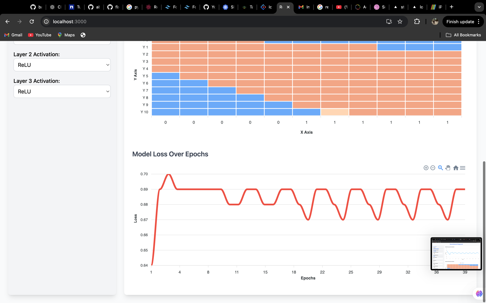

# Neural Network Playground

Neural Network Playground is an interactive React-based web application that enables users to explore the fundamentals of neural networks. This app provides a hands-on way to visualize how changing various network parameters impacts learning and classification.

## Features

- **Customizable Network**: Adjust the number of layers, neurons per layer, activation functions, learning rate, batch size, and number of epochs.
- **Optimizer Selection**: Choose from popular optimizers (`Adam`, `SGD`, `RMSprop`).
- **Dynamic Learning Rate Scheduler**: Option to apply a scheduler that dynamically adjusts the learning rate.
- **Real-Time Charts**:
  - **Accuracy and Loss Over Epochs**: Observe how the model's performance changes with each epoch.
  - **Decision Boundary Heatmap**: Visualizes classification boundaries based on the model's learned patterns.
- **Interactive Controls**: Adjust parameters on the go and see instant changes in model performance.

## Tech Stack

- **Frontend**: React, Tailwind CSS
- **Machine Learning**: TensorFlow.js
- **Visualization**: ApexCharts

## Installation

1. **Clone the repository**:
   ```bash
   git clone https://github.com/yourusername/neural-network-playground.git
   cd neural-network-playground


